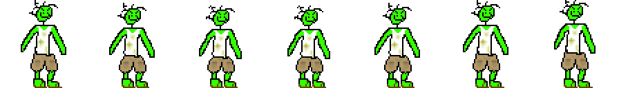

<head>
<audio id="backgroundMusic" loop preload="auto" controlsList="nodownload">
  <source src="/discordBasementSimulator/assets/js/adventuregame/Albuquerq.mp3" type="audio/mpeg">
  Your browser does not support the audio element.
</audio>

<!-- Fallback player that will be hidden but can be used as backup if the main player fails -->

  <button id="fallbackButton" style="background-color: orange; color: white; padding: 5px 10px; border: 2px solid white; cursor: pointer;">
    Try Alternative Player
  </button>

</head>

<h2><a href="/discordBasementSimulator/gamify/adventureGame">Link to Game</a></h2>

<body>
<h1>Tinkers</h1>
So far, we have come up with a few ideas for new features we want to implement into the game level. Here are a few of our works which are finished:
<ul>
    <li>Randomized dialogue with NPCS (where applicable)</li>
    <li></li>
    <li></li>
    <li></li>
    <li></li>
    <li>New HTML element containing WIP minigame (img needs to be updated)</li> 
    <li></li>
    <li></li>
    <li>Replaced "Balance" with "Money Bucks". Earn money bucks by completing the quiz on computer 2. When the password game is finished on computer 1, that will also reward money. Earning 250 dollars allows you to escape the basement by talking to IShowGreen.</li>
    <li></li>
    <li></li>
    <li></li>
    <li>Victory screen and win sfx, ability to restart game</li>
    <li></li>
    <li></li>
</ul>
   

   
<h1>The Idea:</h1> 
<b1>
The premise is simple. The player walks into a strange, rancid basement populated by computers, Dorito crumbs, and a strange fellow known throughout the lands as IShowGreen.
IShowGreen is feverishly at work, without any breaking in his concentration as he mines crypto and rapidly types on his keyboard. The player can explore his many open devices, including a computer where they can play a BitCoin mining minigame and an open discord server where the player can talk to random people online (simulated ofc). 
<h2>Possible ASSETS:</h2> 
<ul>
  <li>Basement BG DONE</li>
  <li>Animated IShowGreen DONE</li>
  <li>Computer sprites DONE</li>
  <li>Music (sneaky snitch or custom beats)</li>
  <li>Sound FX (computer games, IShowGreen talking)</li>
  <li>potential easter eggs</li>
</ul>
<h2>Progression:</h2>
<ul>
  <li>To complete the level, players must obtain at least 100 dollars in crypto to pay IShowGreen and escape the basement.</li>
  <li>One computer NPC will have computer science questions that can be answered for money.</li> 
  <!-- Fix/remove this later when we get a better idea -->
  <li>The other NPC has a crypto mining minigame where the player must create a progressively better password to shield their earnings from hungry hackers.</li>
</ul>
</b1>
<ul>
<li>Custom sprites for basement, Npcs (both computers and IShowGreen)</li>
</ul>
 
 
 
 

<button id="playButton" style="background-color: green; color: white; border: 2px solid white; padding: 5px 10px; margin: 10px; cursor: pointer;">
  Albuquerq.
</button>
mak
</body>